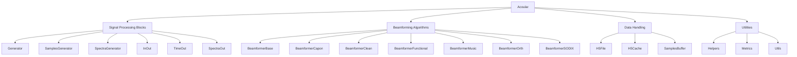

# Project Structure

This document provides a detailed description of each folder and file in the project, including dependencies, libraries, and configuration files.

## Folders and Files

### Root Directory

- **.github/**: Contains GitHub-specific files and workflows.
- **acoular/**: Main source code directory for the Acoular library.
- **docs/**: Documentation files for the project.
- **examples/**: Example scripts and data for using the Acoular library.
- **tests/**: Unit tests and regression tests for the Acoular library.

### .github Directory

- **actions/**: Contains GitHub Actions workflows for CI/CD.
- **ISSUE_TEMPLATE/**: Templates for GitHub issues.
- **workflows/**: GitHub Actions workflow definitions.

### acoular Directory

- **aiaa/**: Contains modules related to the AIAA functionality.
- **demo/**: Demo scripts for the Acoular library.
- **xml/**: XML files for microphone array configurations.
- **__init__.py**: Initialization file for the Acoular library.
- **base.py**: Base classes for signal processing blocks.
- **calib.py**: Calibration-related classes and functions.
- **configuration.py**: Configuration settings for the Acoular library.
- **deprecation.py**: Deprecation warnings and utilities.
- **environments.py**: Classes for different acoustic environments.
- **fastFuncs.py**: Fast functions for signal processing.
- **fbeamform.py**: Frequency domain beamforming classes.
- **fprocess.py**: Frequency domain signal processing classes.
- **grids.py**: Grid-related classes for beamforming.
- **h5cache.py**: HDF5 caching utilities.
- **h5files.py**: HDF5 file handling utilities.
- **internal.py**: Internal utilities for the Acoular library.
- **microphones.py**: Classes for microphone array geometry.
- **process.py**: General signal processing classes.
- **sdinput.py**: Classes for sound device input.
- **signals.py**: Signal generation classes.
- **sources.py**: Classes for different sound sources.
- **spectra.py**: Classes for spectral analysis.
- **tbeamform.py**: Time domain beamforming classes.
- **tfastfuncs.py**: Fast functions for time domain processing.
- **tools/**: Utility functions and classes.
- **tprocess.py**: Time domain signal processing classes.
- **traitsviews.py**: Traits views for the Acoular library.
- **trajectory.py**: Classes for handling source trajectories.
- **version.py**: Version information for the Acoular library.

### docs Directory

- **source/**: Source files for the documentation.
- **Makefile**: Makefile for building the documentation.

### examples Directory

- **benchmark/**: Benchmark scripts for performance testing.
- **data/**: Example data files.
- **introductory_examples/**: Introductory example scripts.
- **io_and_signal_processing_examples/**: Examples for I/O and signal processing.
- **moving_sources_examples/**: Examples for moving sources.
- **tools/**: Example scripts for using Acoular tools.
- **wind_tunnel_examples/**: Examples for wind tunnel measurements.

### tests Directory

- **cases/**: Test cases for different functionalities.
- **data/**: Test data files.
- **regression/**: Regression tests for the Acoular library.
- **unittests/**: Unit tests for the Acoular library.
- **unsupported/**: Unsupported test scripts.
- **utils.py**: Utility functions for testing.

## Dependencies and Libraries

The Acoular library depends on several external libraries, including:

- **numpy**: Fundamental package for scientific computing with Python.
- **numba**: Just-in-time compiler for Python to speed up numerical functions.
- **scipy**: Library for scientific and technical computing.
- **scikit-learn**: Machine learning library for Python.
- **tables**: Hierarchical datasets for Python.
- **traits**: Explicitly typed attributes for Python classes.

Optional dependencies:

- **matplotlib**: Plotting library for Python.
- **pylops**: Linear operators for Python.
- **sounddevice**: Play and record sound with Python.

## Configuration Files

- **.env**: Environment variables for the project.
- **Dockerfile**: Docker configuration for containerizing the project.
- **docker-compose.yml**: Docker Compose configuration for multi-container applications.

## Overall Architecture

The Acoular library is designed with a modular architecture, allowing for flexible and efficient processing of acoustic data. The main components of the library include:

- **Signal Processing Blocks**: These are the core components that perform various signal processing tasks. They are implemented in the `acoular/base.py`, `acoular/fprocess.py`, `acoular/process.py`, and other related files.
- **Beamforming Algorithms**: These algorithms are used to generate acoustic maps from microphone array data. They are implemented in the `acoular/fbeamform.py` and `acoular/tbeamform.py` files.
- **Data Handling**: This includes classes and functions for reading, writing, and managing data. They are implemented in the `acoular/h5files.py`, `acoular/h5cache.py`, and other related files.
- **Utilities**: These are helper functions and classes that support the main components. They are implemented in the `acoular/tools/` directory.

## Main Components and Their Interactions

### Signal Processing Blocks

The signal processing blocks are the building blocks of the Acoular library. They are responsible for generating, processing, and analyzing acoustic signals. The main classes include:

- **Generator**: Base class for all signal generators.
- **SamplesGenerator**: Generates multi-channel time domain signals.
- **SpectraGenerator**: Generates multi-channel frequency domain signals.
- **InOut**: Base class for blocks that receive and return signals in the same domain.
- **TimeOut**: Processes data from any source and returns time domain signals.
- **SpectraOut**: Processes data from any source and returns frequency domain signals.

### Beamforming Algorithms

The beamforming algorithms are used to create acoustic maps from microphone array data. The main classes include:

- **BeamformerBase**: Base class for all beamforming algorithms.
- **BeamformerCapon**: Implements the Capon beamforming algorithm.
- **BeamformerClean**: Implements the Clean beamforming algorithm.
- **BeamformerFunctional**: Implements functional beamforming.
- **BeamformerMusic**: Implements the MUSIC beamforming algorithm.
- **BeamformerOrth**: Implements orthogonal beamforming.
- **BeamformerSODIX**: Implements the SODIX beamforming algorithm.

### Data Handling

The data handling components are responsible for reading, writing, and managing data. The main classes include:

- **H5File**: Handles reading and writing of HDF5 files.
- **H5Cache**: Manages caching of HDF5 files.
- **SamplesBuffer**: Buffers time domain samples for processing.

### Utilities

The utility functions and classes support the main components of the Acoular library. They include:

- **Helpers**: Various helper functions for signal processing.
- **Metrics**: Functions for calculating metrics related to acoustic data.
- **Utils**: General utility functions for the library.

## Architecture Diagram

