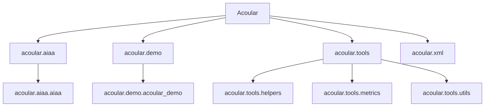
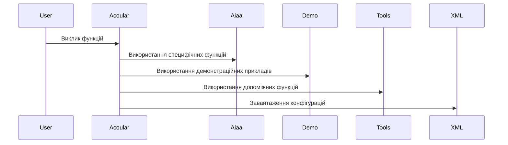
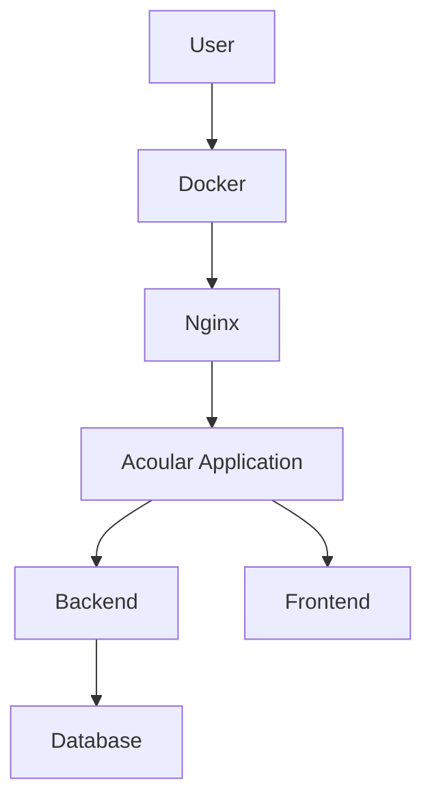

# DIAGRAM.md

## Архітектурні діаграми

### Загальна архітектура проекту

```mermaid
graph TD
    A[Acoular] --> B[acoular.aiaa]
    A --> C[acoular.demo]
    A --> D[acoular.tools]
    A --> E[acoular.xml]
    B --> F[acoular.aiaa.aiaa]
    C --> G[acoular.demo.acoular_demo]
    D --> H[acoular.tools.helpers]
    D --> I[acoular.tools.metrics]
    D --> J[acoular.tools.utils]
```

### Взаємодія між компонентами

```mermaid
sequenceDiagram
    participant User
    participant Acoular
    participant Aiaa
    participant Demo
    participant Tools
    participant XML

    User->>Acoular: Виклик функцій
    Acoular->>Aiaa: Використання специфічних функцій
    Acoular->>Demo: Використання демонстраційних прикладів
    Acoular->>Tools: Використання допоміжних функцій
    Acoular->>XML: Завантаження конфігурацій
```

### Архітектура розгортання

```mermaid
graph TD
    A[User] --> B[Docker]
    B --> C[Nginx]
    C --> D[Acoular Application]
    D --> E[Backend]
    D --> F[Frontend]
    E --> G[Database]
```
